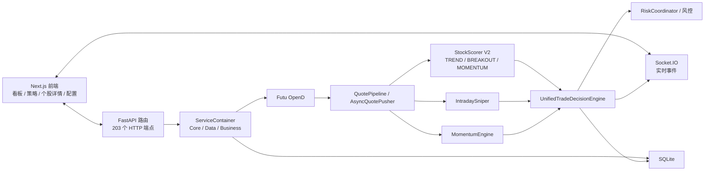
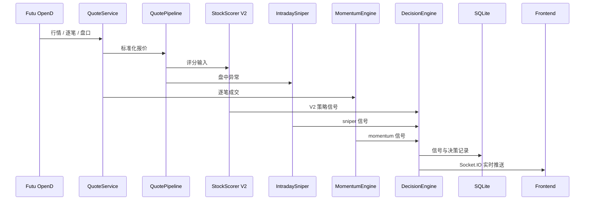

# 系统架构

> 更新时间：2026-06-14。本文以当前运行链路为准：`StockScorer V2` 是主策略体系，`StrategyDispatcher` 为遗留链路。

## 总览

## 模块分层

| 层级 | 路径 | 职责 |
| --- | --- | --- |
| 应用入口 | `simple_trade/app.py`, `simple_trade/asgi.py` | FastAPI 应用、Socket.IO 挂载、生命周期管理 |
| 路由层 | `simple_trade/routers/` | HTTP API，统一使用 `APIResponse` |
| 容器层 | `simple_trade/core/container/` | 初始化核心、数据、业务服务并做依赖注入 |
| 行情流水线 | `simple_trade/core/pipeline/`, `services/core/async_quote_pusher.py` | 行情拉取、缓存、异常检测、推送 |
| 策略评分 | `simple_trade/services/strategy/stock_scorer.py` | V2 三策略评分和交易参数建议 |
| 盘中信号 | `simple_trade/services/sniper/`, `simple_trade/services/momentum/` | 狙击信号、逐笔动量和共振信号 |
| 决策风控 | `simple_trade/services/trading/decision/`, `services/trading/risk/` | 统一决策、风险协调、止盈止损 |
| 数据层 | `simple_trade/database/` | SQLite 表结构、查询封装、迁移兼容 |

## 策略体系

当前主策略不再走 `StrategyDispatcher` 的 `BaseStrategy` 注册模式，而是走 `StockScorer V2`。

| 策略 | 定位 | 当前状态 |
| --- | --- | --- |
| `TREND` | 趋势追涨，关注 5 日涨跌、振幅、量比、逐笔买卖力量 | 主用 |
| `BREAKOUT` | 蓄势突破，关注 5/10/20 日突破、资金流、大单、涨幅位置 | 主用 |
| `MOMENTUM` | 动量接力，关注前日暴涨后的次日低吸/反包 | 主用 |

`StrategyDispatcher`、`StrategyRegistry`、`StrategyScreeningService`、`ScreeningEngine` 是旧链路。2026-06-14 起，`BusinessServices` 启动时不再自动发现和注册旧策略，旧筛选接口只保留兼容返回，不再参与实时交易决策。

## 数据流

## 前端入口

| 页面 | 路径 | 说明 |
| --- | --- | --- |
| 看板 | `futu-trade-frontend/src/app/components/dashboard/` | quotes、positions、signals、decision log |
| 选股 | `stock-picker`, `market-scan` | 股票池筛选和 V2 候选查看 |
| 个股详情 | `stock-detail` | 个股行情、K 线、信号共振 |
| 策略页 | `strategies/page.tsx` | V2 策略说明和归档策略 |
| 配置页 | `config/` | `/api/config` |

## 设计约束

- API 响应保持 `{success, data, message}` 结构。
- 新业务表遵循 `stock_id INTEGER` 关联 `stocks.id`，外部接口和跨系统数据保留 `stock_code TEXT`。
- 报价字段统一使用 `last_price`，必要时通过兼容工具转换旧字段。
- 新策略开发应接入 `StockScorer V2` / `DecisionEngine`，不再扩展 `StrategyDispatcher`。
