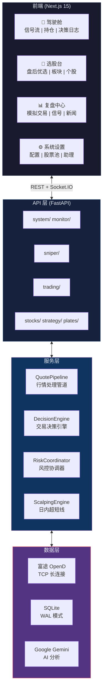
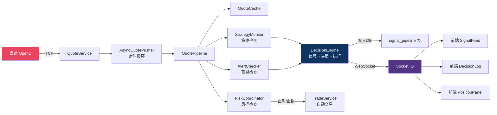
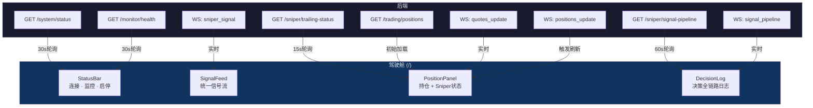
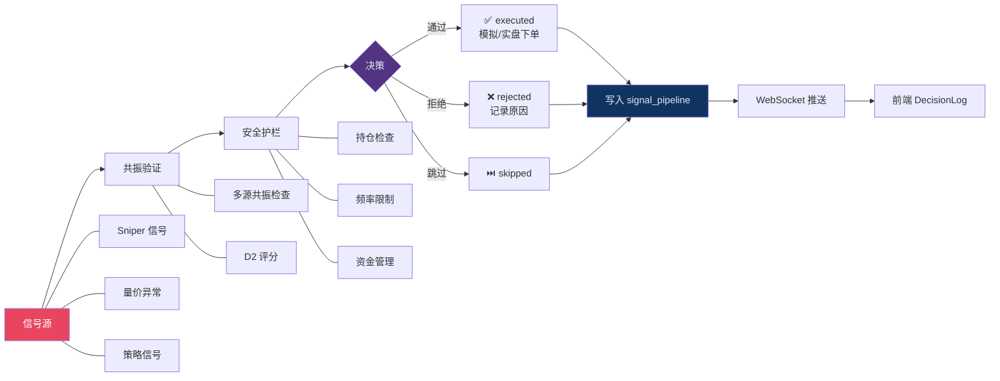
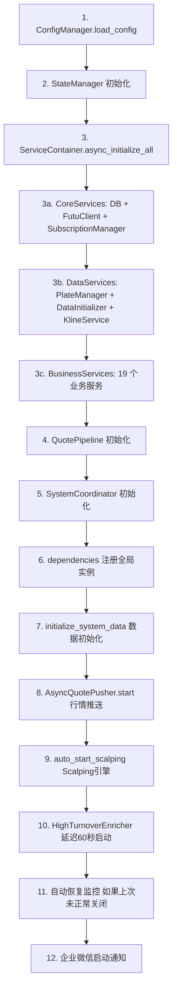

# 富途量化交易系统 — 完整流程文档

> 生成时间: 2026-04-17 | 版本: 2.1.0 | 最后更新: 2026-06-06（前端4视图驾驶舱重构、Sniper止盈状态API）

---

## 一、系统架构总览

### 1.1 技术栈

| 层级 | 技术 |
|------|------|
| Web 框架 | FastAPI 2.0 + Uvicorn (ASGI) |
| 实时通信 | python-socketio (AsyncServer, ASGI 模式) |
| 数据库 | SQLite (aiosqlite 异步 + 同步双模式) |
| 外部 API | Futu OpenD (富途牛牛量化接口, TCP 长连接) |
| AI 分析 | Google Gemini API |
| 通知 | 企业微信群机器人 Webhook |
| 前端 | Next.js |
| 配置 | JSON 文件 + 环境变量 (.env) |
| 日志 | Python logging + RotatingFileHandler |

### 1.2 系统架构流程图



### 1.3 实时数据流



### 1.4 驾驶舱数据流



### 1.5 信号决策管线



### 1.6 项目目录结构

```
futu_trade_sys/
├── run.py                        # 启动脚本 (uvicorn 入口)
├── .env                          # 环境变量
├── simple_trade/                 # 后端主包
│   ├── asgi.py                   # ASGI 入口 (socketio.ASGIApp 包装 FastAPI)
│   ├── app.py                    # FastAPI 应用工厂 + lifespan 生命周期
│   ├── dependencies.py           # 全局依赖注入注册表
│   ├── config.json               # 运行时配置
│   ├── config/                   # 配置管理模块
│   ├── core/                     # 核心框架层
│   │   ├── container/            # 服务容器 (DI)
│   │   ├── pipeline/             # 行情处理管道
│   │   ├── coordination/         # 系统协调器
│   │   ├── state/                # 全局状态管理
│   │   ├── validation/           # 风险预检 + 信号评分
│   │   ├── exceptions/           # 异常处理
│   │   ├── models/               # 领域模型
│   │   └── initialization.py     # 系统数据初始化
│   ├── api/                      # Futu API 客户端封装
│   ├── services/                 # 业务服务层 (12 个子模块)
│   │   ├── core/                 # 核心业务 (行情推送、数据初始化、策略监控)
│   │   ├── trading/              # 交易服务 (下单、风控、止盈止损)
│   │   ├── scalping/             # 日内超短线引擎
│   │   ├── strategy/             # 策略管理 (多策略、信号追踪)
│   │   ├── market_data/          # 市场数据 (板块、K线、盘口、热股)
│   │   ├── alert/                # 预警服务
│   │   ├── advisor/              # AI 决策助理 (Gemini)
│   │   ├── news/                 # 新闻爬虫 + AI 分析
│   │   ├── pool/                 # 股票池管理
│   │   ├── realtime/             # 实时数据查询
│   │   ├── subscription/         # 订阅管理
│   │   └── analysis/             # 综合分析
│   ├── routers/                  # FastAPI 路由层 (23 个路由器)
│   ├── database/                 # 数据库层 (26 张表)
│   ├── strategy/                 # 交易策略定义
│   ├── schemas/                  # Pydantic 数据模型
│   ├── utils/                    # 工具函数
│   ├── websocket/                # WebSocket 管理
│   └── backtest/                 # 回测框架
├── futu-trade-frontend/          # Next.js 前端
├── scripts/                      # 独立脚本
├── tests/                        # 测试
└── docs/                         # 文档
```

### 1.7 核心架构模式 — 分层服务容器

```
ServiceContainer (组合模式, __getattr__ 动态代理)
├── CoreServices              ← 基础设施层
│   ├── db_manager                 DatabaseManager (SQLite)
│   ├── futu_client                FutuClient (TCP 长连接)
│   ├── subscription_manager       SubscriptionManager (订阅额度)
│   ├── quote_service              QuoteService (报价获取)
│   └── stock_data_service         StockDataService (股票数据)
│
├── DataServices              ← 数据服务层
│   ├── plate_manager              PlateManager (板块管理)
│   ├── data_initializer           DataInitializer (数据初始化)
│   ├── subscription_helper        SubscriptionHelper (订阅管理)
│   ├── realtime_query             RealtimeQuery (实时查询)
│   ├── kline_service              KlineDataService (K线)
│   └── stock_pool_service         StockPoolService (股票池)
│
└── BusinessServices          ← 业务逻辑层 (19+ 个服务)
    ├── trade_service              TradeService (交易信号+自动交易)
    ├── futu_trade_service         FutuTradeService (下单封装)
    ├── strategy_monitor_service   StrategyMonitorService (策略监控)
    ├── strategy_screening_service StrategyScreeningService (策略筛选)
    ├── alert_service              AlertChecker (预警检查)
    ├── price_monitor_service      PriceMonitorService (价格监控)
    ├── risk_coordinator           RiskCoordinator (风控协调)
    ├── scalping_engine            ScalpingEngine (日内超短线)
    ├── decision_advisor           DecisionAdvisor (AI 决策)
    ├── hot_stock_service          HotStockCoordinator (热股)
    ├── wechat_alert_service       WeChatAlertService (微信通知)
    └── ...
```

---

## 二、系统启动流程

### 2.1 启动链路

```
run.py
  └── uvicorn("simple_trade.asgi:app")
        └── asgi.py
              ├── app.py → create_app() → FastAPI(lifespan=lifespan)
              └── socketio.ASGIApp(sio, fastapi_app)
```

### 2.2 Lifespan 启动序列 (详细步骤)



### 2.3 数据初始化流程 (`initialize_system_data`)

```
initialize_system_data(container, state_manager)
  │
  ├── 1. PlateManager.initialize_plates()
  │     └── PlateFetcher → Futu API 获取板块列表 → 写入 plates 表
  │
  ├── 2. StockInitializerService.initialize_stocks()
  │     └── PlateStockManager → 获取板块成分股 → 写入 stocks + stock_plates 表
  │
  ├── 3. ExtendedInitializer.initialize_extended_data()
  │     ├── ActivityFilterService → 活跃度筛选 → 标记 is_low_activity
  │     └── KlineDataService → 批量获取K线 → 写入 kline_data 表
  │
  └── 4. StockPoolService.build_pool() → 构建内存股票池
```

### 2.4 关闭流程

```
lifespan finally:
  1. 取消所有后台 asyncio.Task
  2. 停止 AsyncQuotePusher
  3. 停止 ScalpingEngine (含子进程终止)
  4. 保留持久化状态 (以便重启自动恢复)
  5. 关闭企业微信 HTTP 会话
  6. ServiceContainer.cleanup()
```

---

## 三、实时行情数据流

### 3.1 双周期行情管道

系统行情处理分为两个独立周期，由 `AsyncQuotePusher` 驱动：

| 周期 | 触发条件 | 间隔 | 处理内容 |
|------|----------|------|----------|
| 报价周期 `run_quote_cycle()` | 系统启动即运行 | 每5秒 | 获取报价 → 更新缓存 → WebSocket 广播 |
| 监控周期 `run_monitoring_cycle()` | 仅"监控"启动后 | 每5秒 | 风控 → 策略检测 → 信号追踪 → 通知 |

### 3.2 报价周期数据流

```
Futu OpenD (外部, TCP 长连接)
  │
  ▼
FutuClient (api/futu_client.py)
  │
  ▼
AsyncQuotePusher (每5秒触发)
  │
  ▼
QuotePipeline.run_quote_cycle()
  ├── StockDataService.get_real_quotes()     ← 获取实时报价
  ├── StateManager.update_quotes_cache()     ← 更新内存缓存
  └── PipelineBroadcast.broadcast()          ← WebSocket 广播
        └── SocketManager.emit_to_all("stock_update", data)
              └── 前端接收并更新 UI
```

### 3.3 监控周期数据流

```
QuotePipeline.run_monitoring_cycle()  [仅 is_running=True 时执行]
  │
  ├── 1. RiskCoordinator.check_all_risks()     ← 风控检查
  │       ├── PriceMonitorService (价格预警)
  │       ├── LotTakeProfitService (分仓止盈)
  │       ├── LotOrderTakeProfitService (订单止盈)
  │       ├── DynamicStopLossStrategy (动态止损: ATR/百分比/追踪)
  │       └── ScreeningEngine (策略止损)
  │
  ├── 2. IntradayProfitTaker.check()           ← 日内高抛信号
  │
  ├── 3. TradeService.auto_trade()  [每60秒]   ← 策略检测+自动交易
  │       └── StrategyDispatcher → BaseStrategy.check_conditions()
  │
  ├── 4. StrategyMonitorService.check_signals_all()  ← 多策略并行检测
  │
  ├── 5. SignalTracker.update_tracking()       ← 信号效果追踪
  │
  └── 6. WeChatAlertService.alert_trade_signal()  ← 企业微信通知
```

---

## 四、交易信号与执行流程

> **重要**: 本章描述的是 StrategyDispatcher 策略信号流。系统另有一套更完整的信号链路
> （PoolSnapshotScanner + IntradaySniper → DecisionEngine），详见 [SIGNAL_ARCHITECTURE.md](file:///d:/Program%20Files/futu_trade_sys/docs/SIGNAL_ARCHITECTURE.md)
> 和 [SIGNAL_PIPELINE.md](file:///d:/Program%20Files/futu_trade_sys/docs/SIGNAL_PIPELINE.md)。

### 4.1 策略体系

StrategyDispatcher 当前注册的策略：

| 策略 | 类名 | 风格 | 状态 |
|------|------|------|------|
| 趋势反转 (默认) | TrendReversalStrategy | 趋势拐点捕捉 | ✅ 活跃 |
| 强势板块 | StrongPlateStrategy | 板块轮动 | ✅ 活跃 |
| 波段 | SwingStrategy | 中期波段操作 | ❌ 已注释 |

StockScorer 三策略评分（盘中异动评分用）：

| 模式 | 名称 | 目标 | 通过分 |
|------|------|------|--------|
| TREND | 趋势策略 | 强势趋势股 | 60 |
| BREAKOUT | 突破策略 | 技术突破股 | 60 |
| MOMENTUM | 蓄势突破 | 量能蓄势后突破 | 60 |

> 已归档: REVERSAL(超跌反弹) — 2026-05-20 因回测无效归档至 `strategy_archive/reversal_v1.py`

### 4.2 信号生成流程

```
TradeService.auto_trade()  [每60秒, 仅监控启动后]
  │
  ├── 遍历股票池中的活跃股票
  │
  ├── StrategyDispatcher.dispatch(stock, quotes)
  │     └── StrategyRegistry.get(active_strategy)
  │           └── strategy.check_conditions(stock, kline, quotes)
  │                 ├── 技术指标计算 (MA/MACD/KDJ/RSI/布林带等)
  │                 ├── 量价分析
  │                 └── 返回: 买入/卖出/持有 信号
  │
  ├── 写入 trade_signals 表
  │
  ├── 注: StrategyDispatcher 信号当前未接入 DecisionEngine
  │       仅用于 signal_performance 效果追踪
  │
  └── SignalTracker.start_tracking()
        └── 写入 signal_performance 表 (后续追踪信号效果)
```

### 4.3 手动交易流程

```
前端 → POST /trade/buy 或 /trade/sell
  │
  ▼
TradeExecutionRouter
  │
  ├── RiskChecker.pre_check()       ← 风险预检
  ├── FutuTradeService.place_order() ← 调用 Futu API 下单
  ├── 写入 trading_records 表
  └── WebSocket 推送交易结果
```

---

## 五、Scalping 日内超短线引擎

### 5.1 运行模式

| 模式 | 配置值 | 说明 |
|------|--------|------|
| inline | `SCALPING_MODE=inline` | 在主进程的 asyncio 循环中运行 |
| process | `SCALPING_MODE=process` | 子进程独立运行 (独立 Futu 连接 + DB) |

### 5.2 核心数据流

```
Futu OpenD Ticker 订阅 (逐笔成交推送)
  │
  ▼
ScalpingEngine (engine.py)
  │
  ▼ DataDispatcher (数据分发器)
  │
  ├──→ DeltaCalculator        买卖力量对比 (cumulative delta)
  ├──→ TapeVelocityMonitor    成交速度/加速度
  ├──→ POCCalculator          价格聚集点 (Point of Control)
  ├──→ SpoofingFilter         虚假挂单检测
  ├──→ TickCredibilityFilter  数据可信度过滤
  └──→ OFICalculator          订单流失衡 (Order Flow Imbalance)
        │
        ▼
  SignalEngine (信号引擎, 综合判断)
        │
        ├── OrderFlowDivergenceDetector  价量背离检测
        ├── BreakoutSurvivalMonitor      突破存活率监控
        ├── VwapExtensionGuard           VWAP 偏离保护
        ├── PatternDetector              行为模式识别
        └── ActionScorer                 行动评分
              │
              ▼
        交易信号输出
        ├── ScalpingPersistence → SQLite 持久化
        │     (scalping_signals, scalping_delta_history,
        │      scalping_poc_snapshot, scalping_events)
        └── SocketManager → WebSocket 推送到前端
```

### 5.3 Scalping 计算器详解

| 计算器 | 输入 | 输出 | 作用 |
|--------|------|------|------|
| DeltaCalculator | 逐笔成交 | 累计 Delta 值 | 买卖力量对比 |
| TapeVelocityMonitor | 成交时间序列 | 速度/加速度 | 判断成交密度变化 |
| POCCalculator | 成交价量 | 价格控制点 | 寻找关键价格水平 |
| SpoofingFilter | 盘口变化 | 虚假概率 | 过滤诈单干扰 |
| TickCredibilityFilter | 逐笔数据 | 可信度评分 | 过滤异常数据 |
| OFICalculator | 盘口买卖变化 | OFI 值 | 订单流失衡方向 |
| ATRCalculator | 价格序列 | ATR 值 | 波动率评估 |

### 5.4 Scalping 调度器

```
CalcScheduler (周期性任务调度)
  ├── TickerPoller     → 轮询逐笔数据 (事件驱动 + 轮询兜底)
  ├── OrderBookPoller  → 轮询盘口数据
  └── HealthMonitor    → 引擎健康监控
```

---

## 六、风险管理体系

### 6.1 RiskCoordinator — 风控协调器

```
RiskCoordinator.check_all_risks(quotes)
  │
  ├── 1. 价格预警 (PriceMonitorService)
  │     └── AlertChecker → 涨跌幅/振幅阈值检测 → 微信通知
  │
  ├── 2. 分仓止盈 (LotTakeProfitService)
  │     └── 按持仓手数分批止盈 (如: 50%@+5%, 30%@+8%, 20%@+12%)
  │
  ├── 3. 订单止盈 (LotOrderTakeProfitService)
  │     └── 单笔订单级别的止盈管理
  │
  ├── 4. 动态止损 (DynamicStopLossStrategy)
  │     ├── ATR 止损: 基于波动率动态调整
  │     ├── 百分比止损: 固定百分比
  │     └── 追踪止损: 跟随最高价回撤
  │
  └── 5. 策略止损 (ScreeningEngine)
        └── 基于策略信号的止损判断
```

### 6.2 交易前风险预检 (RiskChecker)

```
RiskChecker.pre_check(order)
  ├── 持仓股票数量 ≤ 最大持仓数
  ├── 单股买入金额 ≤ 单股上限
  ├── 总仓位比例 ≤ 仓位上限
  ├── 当日交易次数 ≤ 最大交易次数
  └── 市场时间检查 (交易时段内)
```

---

## 七、监控启动/停止流程

### 7.1 启动监控

```
前端 → POST /monitor/start
  │
  ▼
SystemCoordinator.start()
  ├── 1. FutuClient.is_available()              检查 Futu 连接
  ├── 2. _sync_positions()                      同步持仓到优先订阅
  ├── 3. SubscriptionHelper.subscribe_target_stocks()  初始化订阅
  └── 4. StateManager.set_running(True)
              │
              ▼ AsyncQuotePusher 检测到 is_running=True
              └── 开始执行 run_monitoring_cycle()
```

### 7.2 停止监控

```
前端 → POST /monitor/stop
  │
  ▼
SystemCoordinator.stop()
  └── StateManager.set_running(False)
              │
              ▼ AsyncQuotePusher 检测到 is_running=False
              └── 停止 run_monitoring_cycle() (报价周期仍继续)
```

### 7.3 自动恢复机制

```
系统启动时:
  if state_manager.was_running_before_shutdown():
      → 等待行情推送启动 (3秒)
      → SystemCoordinator.start()
      → 自动恢复上次的监控状态
```

---

## 八、前端通信

### 8.1 WebSocket 事件

| 事件名 | 方向 | 数据内容 |
|--------|------|----------|
| `stock_update` | Server→Client | 实时报价数据 |
| `trade_signal` | Server→Client | 交易信号推送 |
| `status` | Server→Client | 系统状态变更 |
| `error` | Server→Client | 错误信息 |
| `scalping_signal` | Server→Client | Scalping 信号 |
| `scalping_metrics` | Server→Client | Scalping 实时指标 |

### 8.2 REST API 路由分组 (23 个路由器)

| 分组 | 前缀 | 路由器 |
|------|------|--------|
| **系统管理** | `/system` | 系统状态、重启 |
| | `/monitor` | 启动/停止监控 |
| | `/config` | 配置读取/更新 |
| | `/news` | 新闻查询/分析 |
| **行情** | `/quotes` | 实时报价 |
| | `/kline` | K线数据 |
| | `/plates` | 板块列表/强度 |
| **交易** | `/trade` | 买入/卖出/监控 |
| | `/strategy` | 策略配置/切换/筛选 |
| | `/take-profit` | 止盈任务管理 |
| | `/positions` | 持仓/订单查询 |
| | `/advisor` | AI 决策助理 |
| | `/scalping` | Scalping 引擎控制 |
| **数据** | `/stocks` | 股票池/热股/高换手 |
| | `/analysis` | 综合分析 |
| | `/heat` | 增强热度数据 |
| | `/capital` | 资金流向/大单 |
| | `/ticker` | 逐笔数据分析 |
| | `/watchlist` | 自选股管理 |

---

## 九、全局状态管理

### 9.1 StateManager (全局单例)

| 状态域 | 类 | 作用 |
|--------|-----|------|
| 报价缓存 | `QuoteCache` | TTL 管理的实时报价 |
| 股票池 | `PoolState` | 内存中的活跃股票列表 |
| 交易状态 | `TradingState` | 条件数据、信号数据 |
| K线缓存 | dict | 内存中的K线数据 |
| 高换手率 | `HighTurnoverCache` | 高换手率股票缓存 |
| Scalping 指标 | `ScalpingMetrics` | Scalping 实时指标 |
| 逐笔缓存 | `TickerDfCache` | 逐笔 DataFrame |
| 初始化进度 | `InitProgress` | 启动初始化进度追踪 |
| 运行状态 | `_is_running` | 监控开关 |
| 持久化 | `monitor_state.json` | 监控状态持久化 (重启恢复用) |

---

## 十、数据库设计

### 10.1 数据库表 (共 26 张)

| 功能域 | 表名 | 说明 |
|--------|------|------|
| **基础数据** | `stocks` | 股票基础信息 |
| | `plates` | 板块信息 |
| | `stock_plates` | 股票-板块多对多关联 |
| | `kline_data` | 日K线数据 |
| | `kline_5min_data` | 5分钟K线 |
| | `daily_active_stocks` | 每日活跃股票 |
| **交易** | `trade_signals` | 交易信号记录 |
| | `trading_records` | 交易执行记录 |
| | `auto_trade_tasks` | 自动交易任务 |
| | `signal_performance` | 信号效果追踪 |
| **止盈止损** | `take_profit_tasks` | 分仓止盈任务 |
| | `take_profit_executions` | 止盈执行记录 |
| **Scalping** | `scalping_signals` | Scalping 信号 |
| | `scalping_delta_history` | Delta 历史 |
| | `scalping_poc_snapshot` | POC 快照 |
| | `scalping_price_levels` | 价格水平 |
| | `scalping_events` | 事件日志 |
| | `ticker_data` | 逐笔成交数据 |
| **新闻** | `news` | 新闻数据 |
| | `news_stocks` | 新闻-股票关联 |
| | `news_plates` | 新闻-板块关联 |
| **分析** | `capital_flow_cache` | 资金流向缓存 |
| | `big_order_tracking` | 大单追踪 |
| | `advisor_evaluations` | AI 决策评估 |
| **系统** | `system_config` | 系统配置 K-V 存储 |
| | `plate_match_log` | 板块匹配日志 |

---

## 十一、线程与进程模型

```
主进程 (uvicorn worker)
  │
  ├── asyncio 事件循环 (主线程)
  │     ├── FastAPI HTTP 请求处理
  │     ├── AsyncQuotePusher 行情推送循环 (每5秒)
  │     ├── WebSocket (socketio AsyncServer)
  │     ├── 自动恢复监控任务
  │     └── HighTurnoverEnricher (延迟60秒启动)
  │
  ├── ThreadPoolExecutor (默认)
  │     ├── Futu API 同步调用 (run_in_executor)
  │     ├── 策略检测 (同步计算)
  │     ├── 数据库同步查询
  │     └── 风控检查计算
  │
  └── [可选] Scalping 子进程 (SCALPING_MODE=process)
        └── 独立 asyncio 事件循环
              ├── ScalpingWorker
              ├── 独立 Futu TCP 连接
              └── 独立 SQLite 连接
```

---

## 十二、订阅管理

### 12.1 订阅架构

```
SubscriptionManager (api 层, 管理 Futu 订阅额度)
  │
  ▼
SubscriptionHelper (services 层, 业务编排)
  ├── 优先订阅: 持仓股票
  ├── 热度筛选管道: StockFilterHeatPipeline
  │     └── 按热度/活跃度动态筛选需要订阅的股票
  └── 版本管理: SubscriptionVersion
        └── 避免重复订阅，增量更新
```

### 12.2 订阅类型

| 类型 | 用途 | 消费者 |
|------|------|--------|
| QUOTE | 实时报价 | AsyncQuotePusher → QuotePipeline |
| TICKER | 逐笔成交 | ScalpingEngine |
| ORDER_BOOK | 盘口 | OFICalculator, SpoofingFilter |

---

## 十三、AI 与通知

### 13.1 AI 决策助理

```
前端 → POST /advisor/evaluate
  │
  ▼
DecisionAdvisor
  ├── HealthEvaluator → 持仓健康度评估
  ├── RuleCheckers → 规则检查 (技术面+基本面)
  └── GeminiAnalyst → Google Gemini AI 深度分析
        └── 综合建议 → advisor_evaluations 表
```

### 13.2 企业微信通知

```
WeChatAlertService
  ├── alert_system_started()     系统启动通知
  ├── alert_trade_signal()       交易信号通知
  ├── alert_risk_event()         风控事件通知
  └── alert_scalping_signal()    Scalping 信号通知
        │
        ▼
  企业微信群机器人 Webhook → 群消息推送
```

---

## 十四、关键单例与依赖注入

| 单例 | 获取方式 | 作用域 |
|------|---------|--------|
| ServiceContainer | `dependencies.get_container()` | 全应用 |
| StateManager | `core.state.get_state_manager()` | 全应用 |
| SocketManager | `websocket.get_socket_manager()` | 全应用 |
| StrategyRegistry | `StrategyRegistry` 类方法 | 全应用 |
| QuotePipeline | `container.quote_pipeline` | 全应用 |
| SystemCoordinator | `container.system_coordinator` | 全应用 |

---

## 十五、快速定位指南

| 我想找... | 看这里 |
|-----------|--------|
| 系统启动逻辑 | `app.py` → `lifespan()` |
| 服务初始化顺序 | `core/container/business_services.py` |
| 实时报价推送 | `services/core/async_quote_pusher.py` |
| 交易信号生成 | `core/pipeline/quote_pipeline.py` → `_run_strategy_detection()` |
| 自动交易下单 | `services/trading/trade_service.py` → `auto_trade()` |
| Futu API 调用 | `api/futu_client.py` |
| 订阅管理 | `api/subscription_manager.py` + `services/subscription/subscription_helper.py` |
| 数据库表结构 | `database/models/schema.py` → `base_tables.py` + `business_tables.py` |
| API 路由 | `routers/__init__.py` 查看路由注册表 |
| 策略实现 | `strategy/` 目录，默认策略 `trend_reversal/strategy.py` |
| Scalping 信号 | `services/scalping/signal_engine.py` |
| 风控逻辑 | `services/trading/risk/risk_coordinator.py` |
| 止盈止损 | `services/trading/profit/` + `services/trading/risk/` |
| 配置修改 | `config/config.py` (默认值) + `config.json` (运行时) |
| 系统状态 | `core/state/state_manager.py` |
| WebSocket 事件 | `websocket/events.py` |
| 企业微信通知 | `services/alert/wechat_alert.py` |
| AI 分析 | `services/advisor/analyst/gemini_analyst.py` |
| 新闻爬虫 | `services/news/news_crawler.py` |
| 回测 | `backtest/` + `scripts/backtest_*.py` |
| 系统 Metrics | `GET /system/metrics` (运行时指标快照) |

---

## 十六、回测框架

### 16.1 架构

```
backtest/
├── core/
│   ├── engine.py              BacktestEngine — 回测主引擎 (日线级别)
│   ├── intraday_engine.py     IntradayEngine — 日内回测引擎
│   ├── data_loader.py         DataLoader — 数据加载器
│   ├── loaders/               多数据源加载器
│   ├── analyzer.py            Analyzer — 回测结果分析器
│   ├── reporter.py            Reporter — 回测报告生成器
│   ├── fee_calculator.py      FeeCalculator — 港股费用计算
│   └── strategy_adapter.py    StrategyAdapter — 适配实盘策略到回测
├── strategies/                回测专用策略实现
├── utils/                     回测工具函数
└── optimizer.py               参数优化器 (网格搜索)
```

### 16.2 回测流程

```
scripts/backtest_trend_reversal.py (入口脚本)
  │
  ├── 1. DataLoader.load()
  │     └── 从 SQLite 或 CSV 加载历史 K 线数据
  │
  ├── 2. StrategyAdapter.adapt(TrendReversalStrategy)
  │     └── 将实盘策略接口适配为回测接口
  │
  ├── 3. BacktestEngine.run()
  │     ├── 逐日遍历 K 线
  │     ├── 调用策略 check_conditions()
  │     ├── FeeCalculator 计算港股交易费用
  │     │     (佣金 + 平台使用费 + 印花税 + 交易征费 + ...)
  │     └── 记录交易和持仓变化
  │
  ├── 4. Analyzer.analyze()
  │     ├── 计算收益率、最大回撤、夏普比率
  │     ├── 胜率统计
  │     └── 按月/按策略分组统计
  │
  └── 5. Reporter.generate()
        └── 输出 HTML/JSON 报告到 backtest_results/
```

### 16.3 参数优化

```
optimizer.py
  ├── GridSearchOptimizer
  │     └── 网格搜索策略参数组合
  ├── 每组参数运行完整回测
  └── 输出最优参数组合 + 收益对比表
```

---

## 十七、前端页面路由映射

### 17.1 技术栈

Next.js (App Router) + TailwindCSS + shadcn/ui

### 17.2 页面与后端 API 对应关系

| 前端页面路径 | 功能 | 对应后端 API |
|-------------|------|------------|
| `/` (page.tsx) | 首页仪表盘 | `GET /quotes`, `WS stock_update` |
| `/stock-pool` | 股票池管理 | `GET/POST /stocks` |
| `/stock-pool-monitor` | 股票池监控 | `GET /stocks`, `WS stock_update` |
| `/trading` | 交易面板 | `POST /trade/buy\|sell`, `GET /positions` |
| `/advisor` | AI 决策助理 | `POST /advisor/evaluate` |
| `/kline` | K线图表 | `GET /kline` |
| `/plate` / `/plates` | 板块分析 | `GET /plates` |
| `/news` | 新闻中心 | `GET /news` |
| `/config` | 系统配置 | `GET/PUT /config` |
| `/conditions` | 策略条件 | `GET /strategy` |
| `/enhanced-heat` | 增强热度 | `GET /heat`, `GET /heat/summary` |
| `/high-turnover` | 高换手率 | `GET /stocks/high-turnover` |
| `/price-analysis` | 价格分析 | `GET /analysis` |
| `/unsubscribed-stocks` | 未订阅股票 | `GET /stocks/activity` |

### 17.3 前端目录结构

```
futu-trade-frontend/src/
├── app/                    # Next.js App Router 页面
│   ├── page.tsx            # 首页仪表盘
│   ├── layout.tsx          # 全局布局
│   ├── providers.tsx       # Context Providers
│   ├── globals.css         # 全局样式
│   ├── hooks/              # 自定义 Hooks
│   ├── components/         # 页面级组件
│   └── api/                # API Route Handlers (BFF)
├── components/             # 全局共享组件
├── lib/                    # 工具库 (API 客户端、WebSocket 等)
└── types/                  # TypeScript 类型定义
```

---

## 十八、系统可观测性

### 18.1 Metrics 端点

通过 `GET /api/system/metrics` 获取系统运行时指标快照。

### 18.2 已埋点指标

| 指标名 | 类型 | 说明 |
|--------|------|------|
| `api.futu.calls` | Counter | Futu API 累计调用次数 |
| `api.futu.qps` | Rate | Futu API 每秒调用频率 (60秒窗口) |
| `scalping.ticks_per_sec` | Rate | Scalping 引擎每秒处理 tick 数 |

### 18.3 扩展方式

```python
from simple_trade.utils.metrics import get_metrics

m = get_metrics()
m.counter("my.counter").inc()           # 计数器
m.gauge("my.gauge").set(42)             # 瞬时值
m.histogram("my.latency_ms").observe(12.5)  # 延迟分布
```

---

## 十二、前端架构（4 视图交易员驾驶舱）

> 2026-06 重构：从 30+ 独立页面精简为 4 视图 Tab 架构，遵循"盘中不切页面"原则。

### 12.1 导航结构

```
Sidebar (4 入口)
├── 🎯 驾驶舱 (/)        ← 盘中单屏作战，信号+持仓+决策一屏搞定
├── 📡 选股台 (/discovery) ← 盘前/盘后选股研究（4 Tab 懒加载）
├── 📊 复盘中心 (/review)  ← 交易记录与信号追踪（4 Tab 懒加载）
└── ⚙️ 系统设置 (/settings) ← 配置、股票池、决策助理
```

### 12.2 驾驶舱 — 盘中单屏布局

```
┌─────────────────────────────────────────┐
│  StatusBar: WS连接 · 监控状态 · 启停    │
├─────────────────────────────────────────┤
│  StrategyPanel: 当前策略                │
├──────────────────┬──────────────────────┤
│  SignalFeed      │  PositionPanel       │
│  统一信号流      │  持仓 + 实时盈亏     │
│  (3/5 宽度)      │  + Sniper止盈状态    │
│  Scanner+Sniper  │  🟢追踪 🔴即将止盈  │
│  +量价预警       │  (2/5 宽度)          │
├──────────────────┴──────────────────────┤
│  DecisionLog: 信号→决策→执行 全链路     │
│  (可折叠, DB持久化, WS实时推送)         │
└─────────────────────────────────────────┘
```

**组件文件**: `components/cockpit/`

| 组件 | 数据来源 | 刷新方式 |
|------|----------|----------|
| `StatusBar` | `/system/status` + `/monitor/health` | 30s 轮询 |
| `SignalFeed` | `UnifiedSignalFeed` 组件 | WS `sniper_signal` |
| `PositionPanel` | `/trading/positions` + `/sniper/trailing-status` | WS `quotes_update` + 15s 轮询 |
| `DecisionLog` | `/sniper/signal-pipeline` | WS `signal_pipeline` + 60s 轮询 |

### 12.3 选股台 — Tab 式整合

通过 `React.lazy()` 动态 import 复用现有页面组件，零改造：

| Tab | 组件 | 功能 |
|-----|------|------|
| 🌙 盘后优选 | `OvernightScreenCard` | 盘后策略筛选结果 |
| 🔥 板块热度 | `PlatesPage` | 板块强势度排行 + 龙头股 |
| 🎯 选股工作台 | `StockPickerPage` | 高换手 + 市场扫描 + 评分 |
| 🔍 个股分析 | `StockDetailPage` | K线 + 资金流 + 盘口 |

### 12.4 复盘中心 — Tab 式整合

| Tab | 组件 | 功能 |
|-----|------|------|
| 💰 模拟交易 | `SimulatedTradesPage` | 今日模拟交易记录 |
| 🔫 信号总览 | `SniperSignalsPage` | Sniper 信号排行 |
| ⚡ 交易决策 | `PreCheckPage` | 下单前风险预检 |
| 📰 热点新闻 | `NewsPage` | AI 摘要新闻 |

### 12.5 前端数据流

```
WebSocket 事件 (Socket.IO)
  ├── quotes_update      → 实时价格 → PositionPanel 盈亏更新
  ├── signal_pipeline    → 决策流水 → DecisionLog 实时追加
  ├── sniper_signal      → Sniper 信号 → SignalFeed 信号卡片
  ├── anomaly_signal     → 量价异常 → SignalFeed 信号卡片
  └── positions_update   → 持仓变动 → 触发 refetchPositions()

REST API (通过 Next.js catch-all proxy 代理到后端)
  ├── /api/sniper/trailing-status  → Sniper止盈追踪状态 (NEW)
  ├── /api/sniper/signal-pipeline  → 决策流水记录 (DB)
  ├── /api/system/status           → 系统状态
  ├── /api/monitor/health          → 监控健康度
  └── /api/trading/positions       → 持仓列表
```

### 12.6 前端 API 层

所有 API 调用集中在 `lib/api/` 目录，每个文件对应一个后端模块：

```
lib/api/
├── client.ts          ← Axios 实例 (响应拦截器提取 .data)
├── index.ts           ← 统一导出
├── system.ts          ← /system/, /monitor/
├── sniper.ts          ← /sniper/ (NEW: 含 trailing-status)
├── trade.ts           ← /trading/
├── stock.ts           ← /stocks/
├── strategy.ts        ← /strategy/
├── config.ts          ← /config/
├── analysis.ts        ← /analysis/
├── quote.ts           ← /quotes/
├── advisor.ts         ← /advisor/
└── position-order.ts  ← /trading/positions, /trading/orders
```
